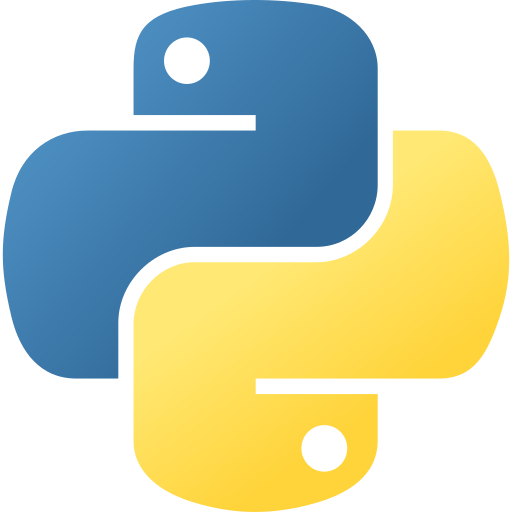
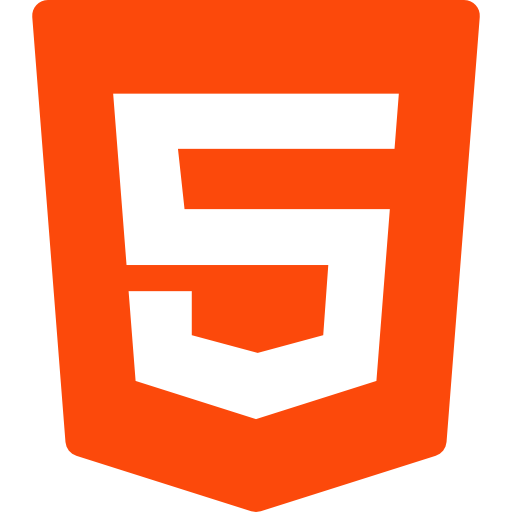
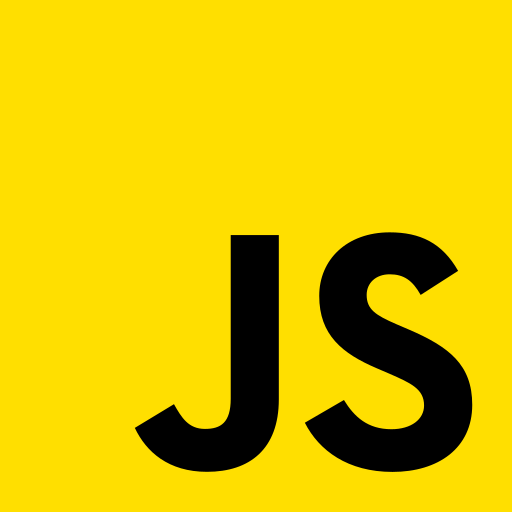
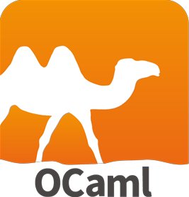
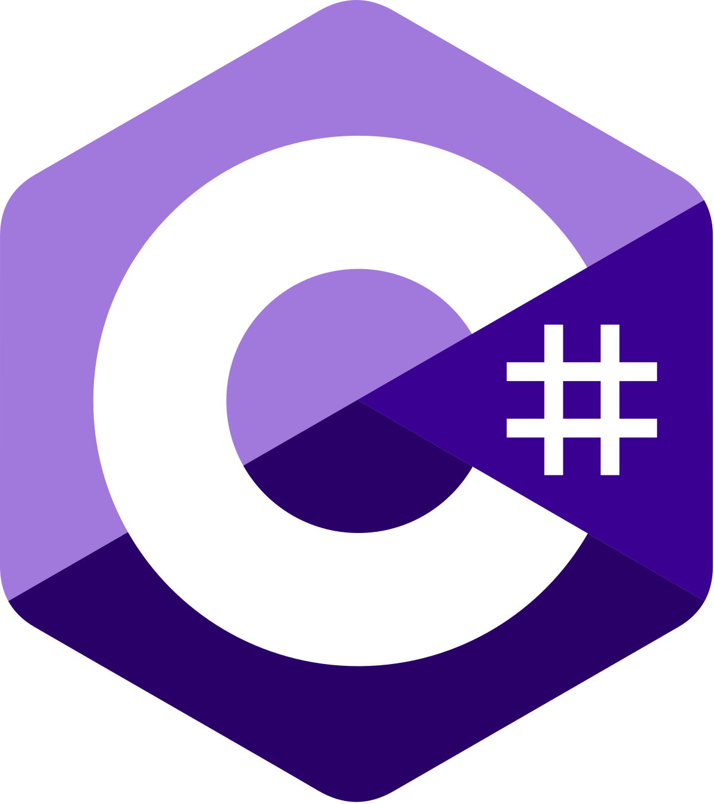

# 
👋Hello Visiteur, moi c'est Olivier

## 📄A propos

 Je suis un Etudiant de l'IIM qui souhaite s'epanouir dans le milieu du developpement et du design sur le web. j'ai suivis un cursus général dans mes années lycée et j'ai rapidement été prit de passions pour le developpement et nottament sur celui concernant les sites web et applications. je pratiques de multiples activités nottament le sport, les jeux-vidéos et la sophrologie qui m'aide à garder pied sur terre au quotidien.

## 
💪Mes compétences

## 
🔗Références

### Sites

Mon cv ➡️ [cliquez ici pour accéder au cv](https://cv-responsive.solide.repl.co)

Site de l'IIM ➡️ [cliquez ici pour accéder au site](https://www.iim.fr)

### Languages

 

## 📧Contact 

olivier.delmas@edu.devinci.fr ⬅️ mail

[cliquez ici pour accéder au profile](https://www.linkedin.com/in/olivierdlms/) ⬅️ Likedin

🪛 In progress ⬅️ portfolio

